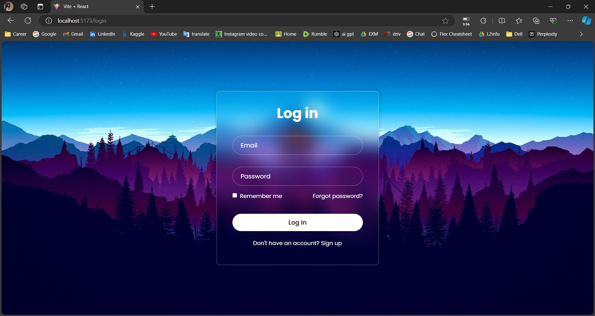

# MyTodoApp Screenshots

## Login Screen

This is the login screen where users can enter their credentials to access the app.

## Signup Screen

New users can create an account on this signup screen.

## Home Screen

The home screen provides an overview of the user's tasks and quick access to main features.

## Todo List View

Users can view all their todos in a list format on this screen.

## Task View

This screen shows the details of a specific task.

## Add Task Screen

Users can add new tasks using this screen.

## AI Todo List

This screen showcases the AI-powered todo list feature.
